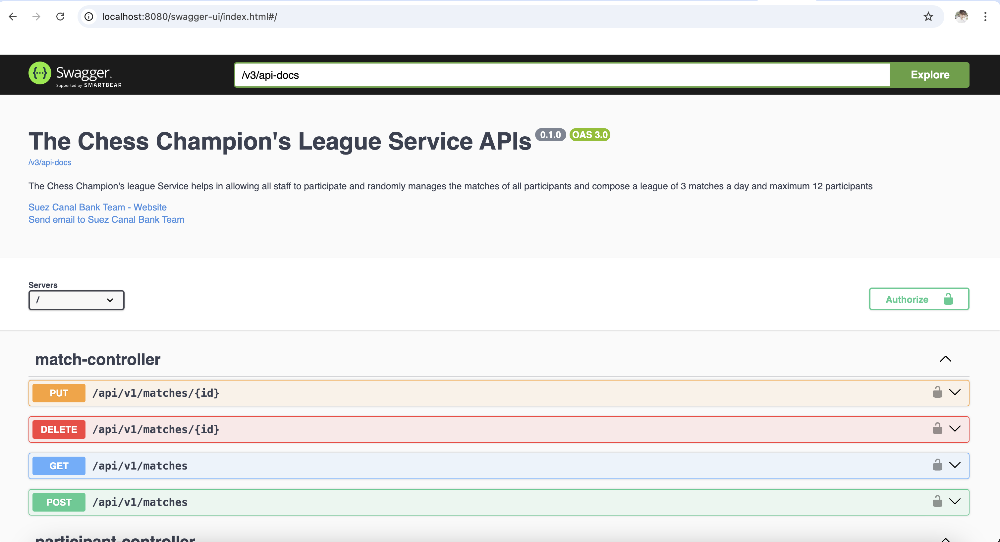
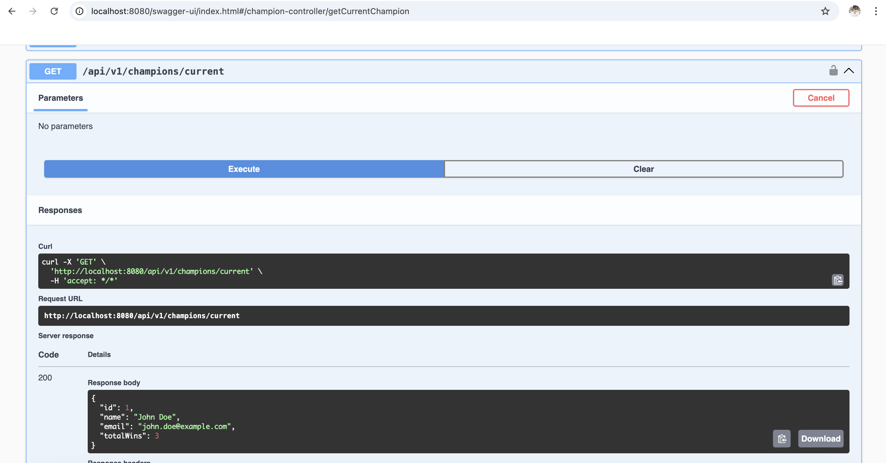
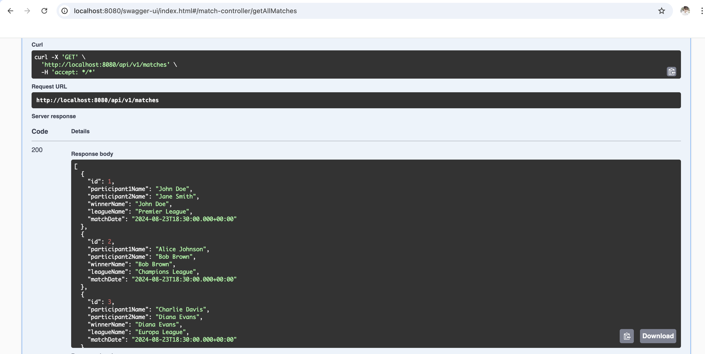
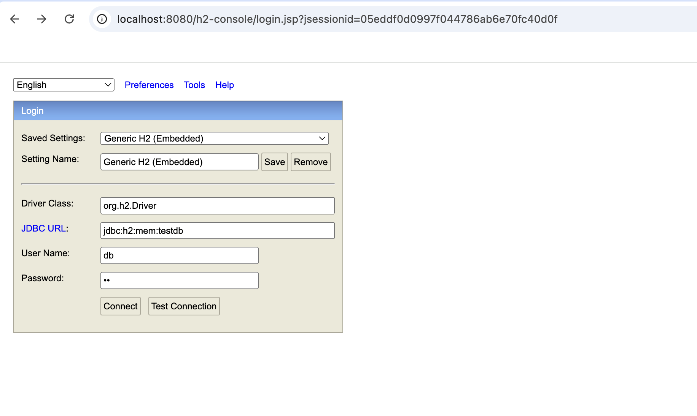
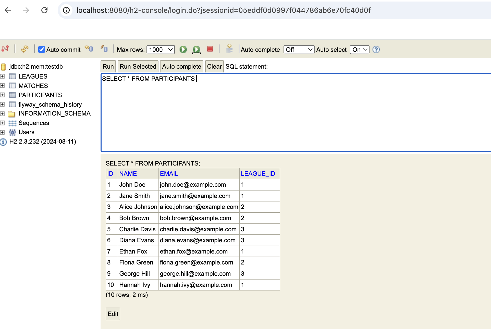

# The Champion League Application

This project is a backend application for managing a league of participants, matches, and champions. It is built using Java, Spring Boot, and several other technologies to provide RESTful APIs for managing the league. The application also includes data migration, in-memory database management, and API documentation.

## Features

- **RESTful APIs**: Provides endpoints to manage leagues, matches, participants, and champions.
- **In-Memory Database**: Uses H2 for quick setup and testing.
- **Data Migration**: Flyway is integrated for managing database migrations.
- **API Documentation**: Swagger is configured for easy API documentation and testing.
- **Modular Structure**: Organized into Entities, DTOs, services, controllers, and repositories.

## Technology Stack

- **Java**
- **Spring Boot**
- **H2 Database**
- **Flyway**
- **Maven**
- **Swagger**

## Project Structure

The project is structured into several components:

### Controllers

- **ChampionController**: Manages champion-related operations.
- **LeagueController**: Handles CRUD operations for leagues.
- **MatchController**: Manages match-related operations.
- **ParticipantController**: Handles operations related to participants.

### Models

- **League**: Represents a league in the system.
- **Match**: Represents a match within a league.
- **Participant**: Represents a participant in a league.

### Repositories

- **LeagueRepository**: Handles database operations for leagues.
- **MatchRepository**: Manages match-related database operations.
- **ParticipantRepository**: Handles database operations for participants.

### Services

- **ChampionService**: Business logic related to champions.
- **EmailService**: Handles email-related functionalities, such as sending congratulation emails.
- **LeagueService**: Business logic for managing leagues.
- **MatchService**: Business logic for handling matches.
- **ParticipantService**: Business logic related to participants.

## Getting Started

### Prerequisites

- Java 8 or higher
- Maven 3.6.3 or higher
- Spring Boot 3.2.0 or higher
- H2 database 2.3.0 or higher
- Flyway 10.0.0 or higher

### Setup

1. #### Clone the repository:
   ```bash
   git clone https://github.com/Nyamathhh/The-Chess-Champion-League.git
   
   cd The-Chess-Champion-League
   
2. #### Build the project using Maven:
    ```bash    
    mvn clean install

3. #### Run the application:
    ```bash
   mvn spring-boot:run

4. #### Access the application:
    
###### Swagger UI: http://localhost:8080/swagger-ui/index.html#/








###### H2 Console: http://localhost:8080/h2-console/

-  JDBC URL : jdbc:h2:mem:testdb
-  User Name : db
-  Password : db






5. #### Database Migration

- Flyway is used for managing database migrations, with SQL scripts placed in specific directories:

- **Migration Files** (`resources/db/migration`):
    - `V1__Create_Tables.sql`: Creates the necessary database tables.
    - `V2__Leagues_DML.sql`: Inserts initial data for leagues.
    - `V3__Participants_DML.sql`: Inserts initial data for participants.
    - `V4__Matches_DML.sql`: Inserts initial data for matches.


- **DDL Scripts** (`resources/db/scripts`): Contains additional SQL scripts that might be required for database management outside of the Flyway migration process.


6. #### Testing

###### Unit tests are included and can be run using the following command:

To run the tests:

```bash
mvn test